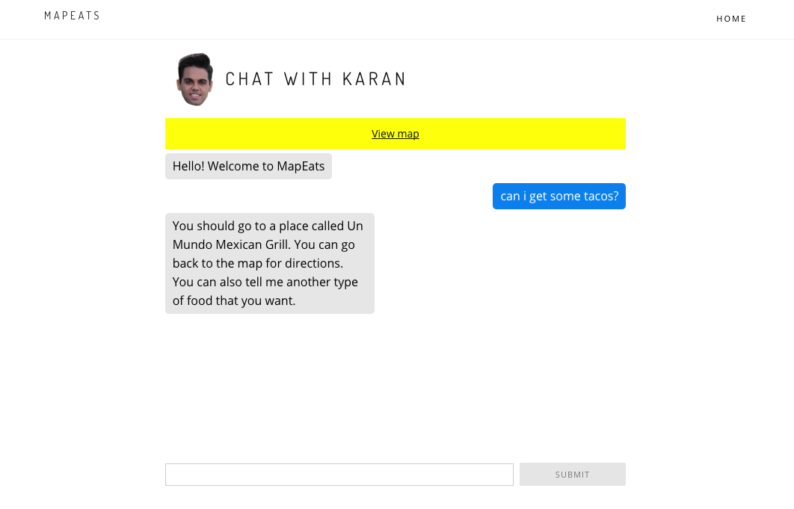
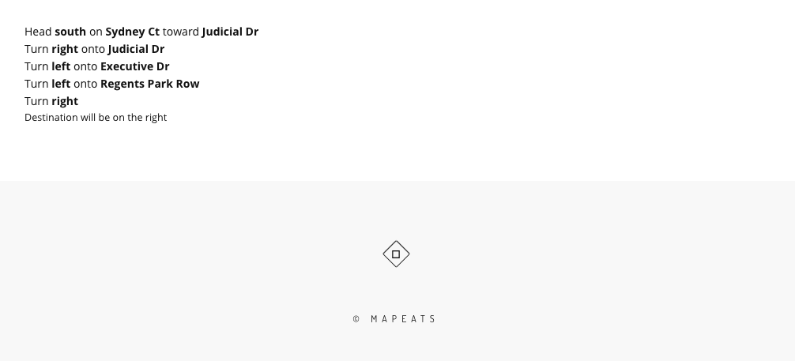

# Milestone 11

### Group Member Contributions
Alex Barcenas:
  - Improved bot logic and user command recognition
  - Refined UI interactions of chatbot
 
Albert Lin:
  - Restructured UI elements across page to better suit user interaction flow
  - Fixed chat UI issues

Sanjeev Reddy:
  - Still working on making map InfoWindows compatible with Angular (not yet
    working, see "infowindow" branch)
  - Created markdown file

Todd Tang:
  - Added capability for chat bot to give directions
  - Ironed out geolocation issues

### Screenshots
Chatbot view: This screenshot shows the current functionality of our chatbot.
The chatbot now prompts users to return to the map to get directions to the
restaurant it is recommending.

Directions view: This screenshot demonstrates a new feature that provides the
user with written directions to their destination. It will serve as a complement
to the map directions.

