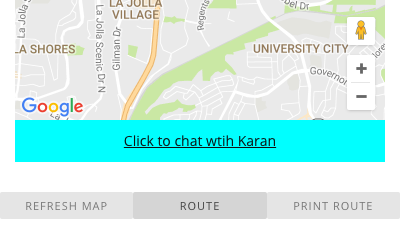

# Milestone 11

### Group Member Contributions
Alex Barcenas:
  - Improved bot logic and user command recognition
 
Albert Lin:
  - Added "About" page with basic instructions
  - Added functional buttons for map interactions

Sanjeev Reddy:
  - Still working on making map InfoWindows compatible with Angular (not yet
    working, see "infowindow" branch)
  - Created markdown file

Todd Tang:
  - Refined routing operations
  - Helped Albert with UI

### Screenshots
About/Tutorial view: This screenshot displays the current state of our "more
info" page. The user can access this page by clicking on the "About" link at
the top right of the webpage. Here, we display a quick overview of what our
application is and how to use it.

Map Buttons view: This screenshot demonstrates newly added buttons that
allow the user to refresh the map, route to a destination, and print directions
to the screen.

