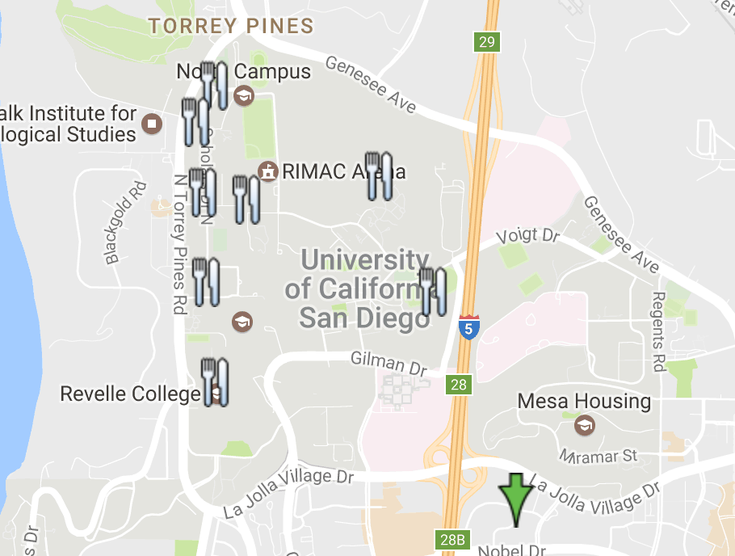
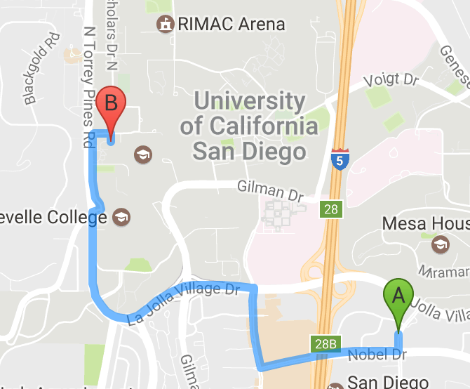
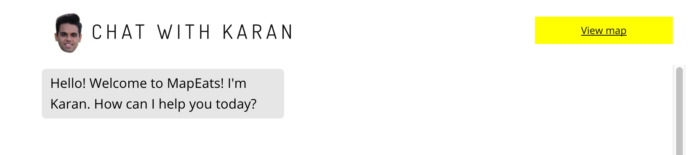
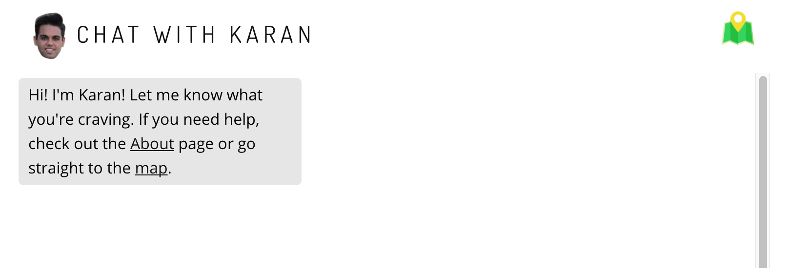

# Milestone 14

### Group Member Contributions
Alex Barcenas:
  - Improved the bot's word recognition of food items.
 
Albert Lin:
  - adf
  - adf

Sanjeev Reddy:
  - Made the map unclickable by the user to avoid messing with the direction markers.
  - Removed the fake data points added at the beginning of the project.

Todd Tang:
  - Attempted to resolve info window issues for displaying retaurant information.
  
### Screenshots

Fake data removal: There was fake data populating the UCSD region of our map. However, we opted for just using one place that will be displayed based on the chat results. This decision was made due to some feedback we got and some complications we had with implementing multiple locations.

Map with fake data:

Map with no fake data:

View Map Button: These screenshots shows the change made to the view map button that was suggested by the TA in order to stray away from just using text.

Old view map button:

New view map button:

