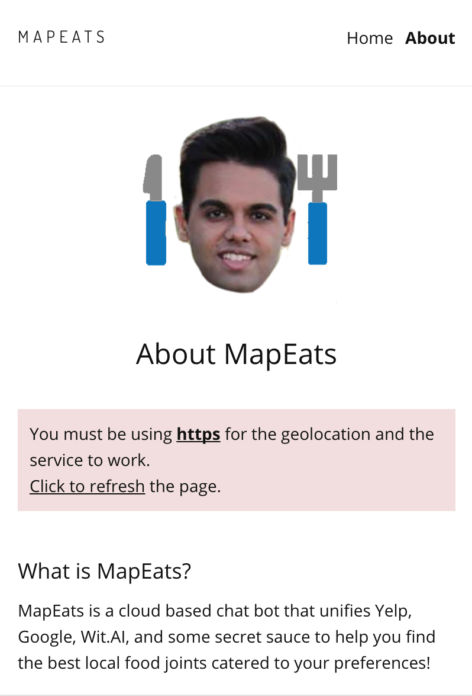

# Milestone 14

### Group Member Contributions
Alex Barcenas:
  - Improved the bot's word recognition of food items.
  - Worked on markdown file.
 
Albert Lin:
  - Added loading animations to indicate to user that chatbot is working.
  - Added UI updates and refinements.

Sanjeev Reddy:
  - Made the map unclickable by the user to avoid messing with the direction markers.
  - Removed the fake data points added at the beginning of the project.
  - Added functionality to open directions in Google Maps.
  - Made UI refinements.

Todd Tang:
  - Attempted to resolve info window issues for displaying retaurant information.
  
### Completed Features
#### Chatbot
Our chatbot, Karan, understands various user commands and responds to different types of food requests with appropriate responses.

#### Map with directions
We have integrated our map with Karan's responses. It automatically gives the user a quick view of directions to the restaurant Karan suggested. We also display written directions beneath the map for the user's convenience.

#### Open directions in Google Maps
By clicking on the "Open Directions in Google Maps" button, the user can get more detailed directions to the restaurant suggested by Karan. This is especially useful for people who want the convenience of Google's GPS functionality.

#### About page/tutorial
MapEats has an "About/tutorial" page that provides the user with introductory information regarding our application and how to use it. Note that the user is prompted by Karan to visit this page if they are unsure of how to use MapEats (see chatbot screenshots).

