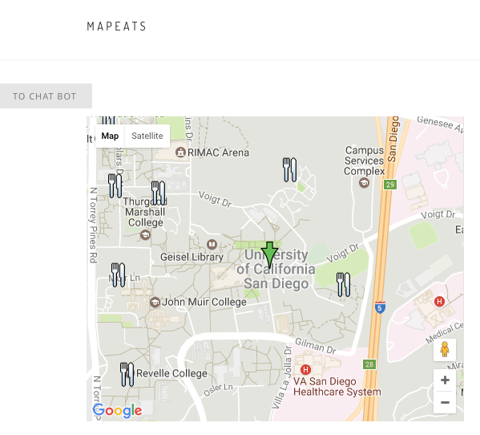
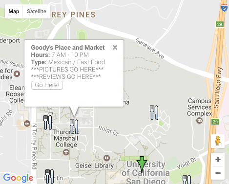
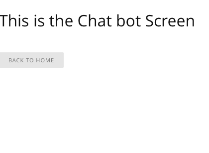

# Milestone 5

### Group Member Contributions
Alex Barcenas:
  - Learning Yelp! API and preparing it for integration with Google Maps
 
Albert Lin:
  - Provided boilerplate HTML
  - Worked on drafting potential UI layouts (not yet implemented)

Sanjeev Reddy:
  - Set up Google Maps for milestone (prepopulate restaurants, add icons/infowindows)
  - Created markdown file

Todd Tang:
  - Migrated code to MEAN stack
  - Set up Google Maps API keys and integration into webpage
  - Implemented basic UI elements

### Screenshots
Relevant homepage view: This screenshot shows the relevant elements of the
homepage--the map and the option to toggle the chatbot. The map is currently
centered around campus (will later be centered about the user's location) and
has been prepopulated with restaurants around campus.

Restaurant InfoWindow view: This screenshot demonstrates a rough skeleton of
the information that will be conveyed to the user when they select a restaurant
on the map.

Chatbot view: This screenshot shows the page that the user will be taken to
when they decide to toggle the chatbot. We will later implement the chat AI
functionality on this page.

