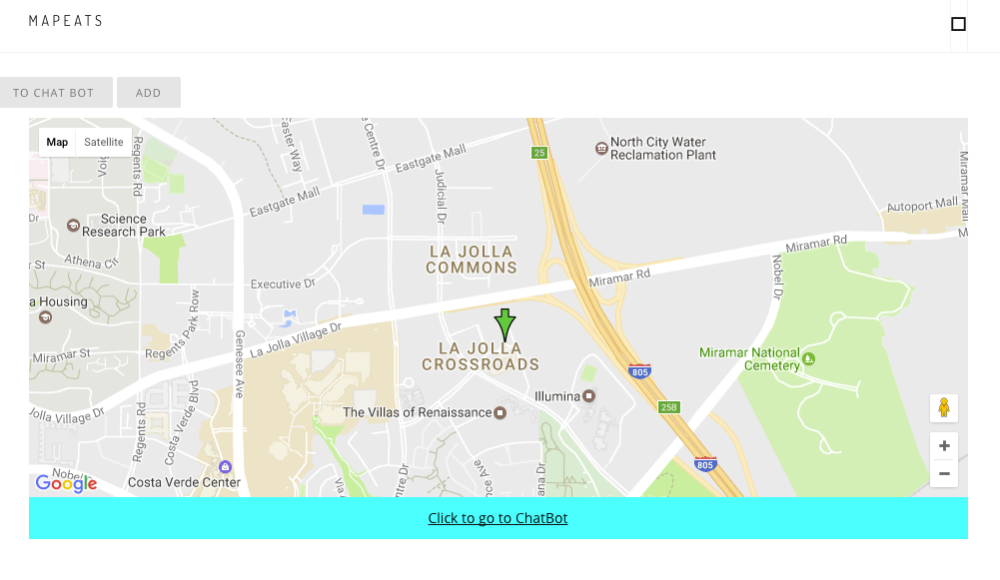
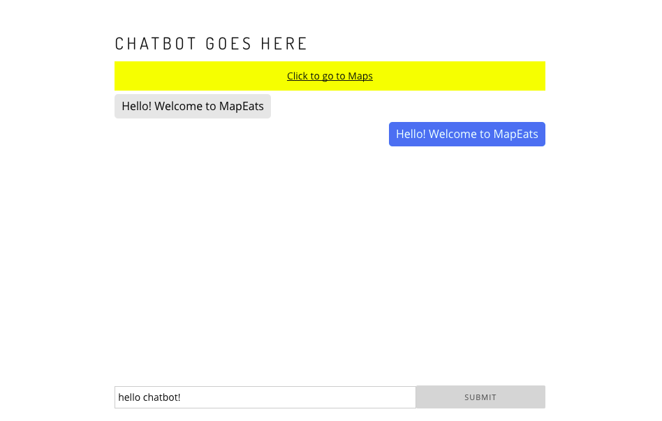

# Milestone 7

### Group Member Contributions
Alex Barcenas:
  - Integrated Wit.ai and Yelp API's with Angular
  - Helped port chat interface into application
 
Albert Lin:
  - Updated UI elements to make application more streamlined
  - Formatted chat window and navigation

Sanjeev Reddy:
  - Worked on integrating Socket.io with Angular (not yet working, see "socket" branch)
  - Created markdown file

Todd Tang:
  - Added geolocation to main map interface

### Screenshots
Map view: Our map now centers itself on the user's location instead of a
hardcoded value. The next step for our group in relation to the map, is to make
use of Yelp's API to prepopulate the map with restaurants. There are still some
redundant navigational UI elements visible in this view that we plan to refine.

Chatbot view: This screenshot shows the current state of our chat window. It is
structured in a manner similar to other popular chat applications (Messenger,
Google Hangouts, etc). Currently, the chat functionality is not present, but
this will change once we get Socket.io integrated with our application.

