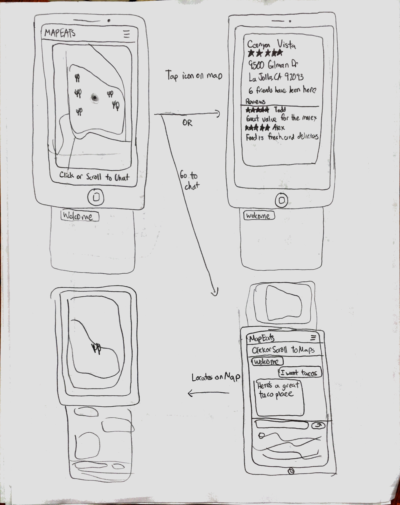
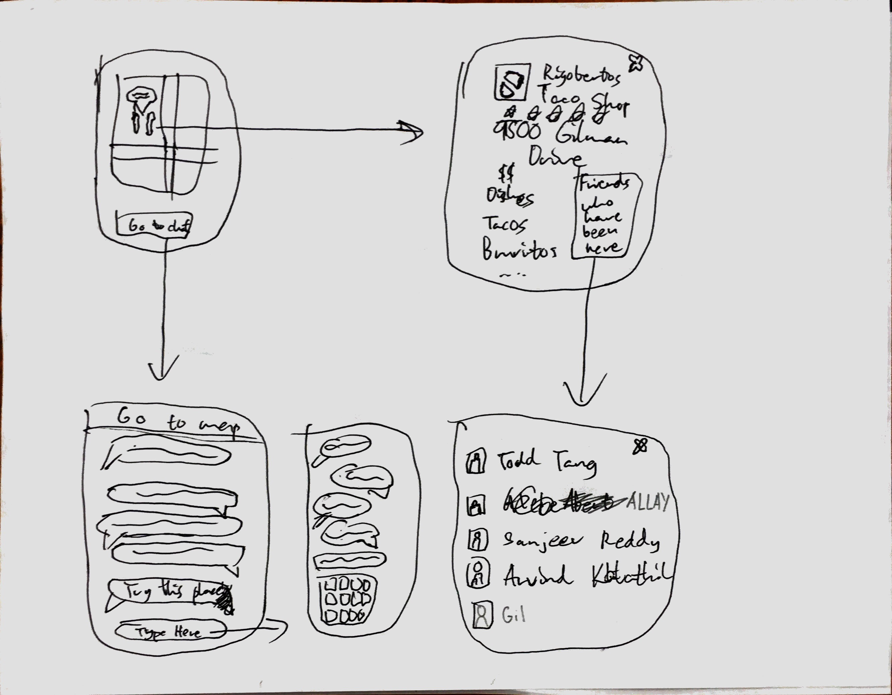
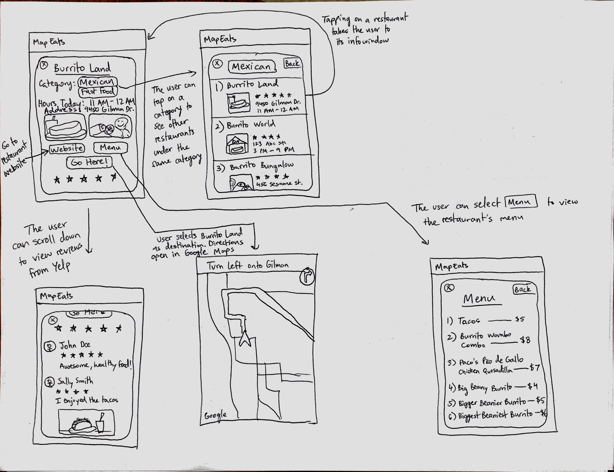
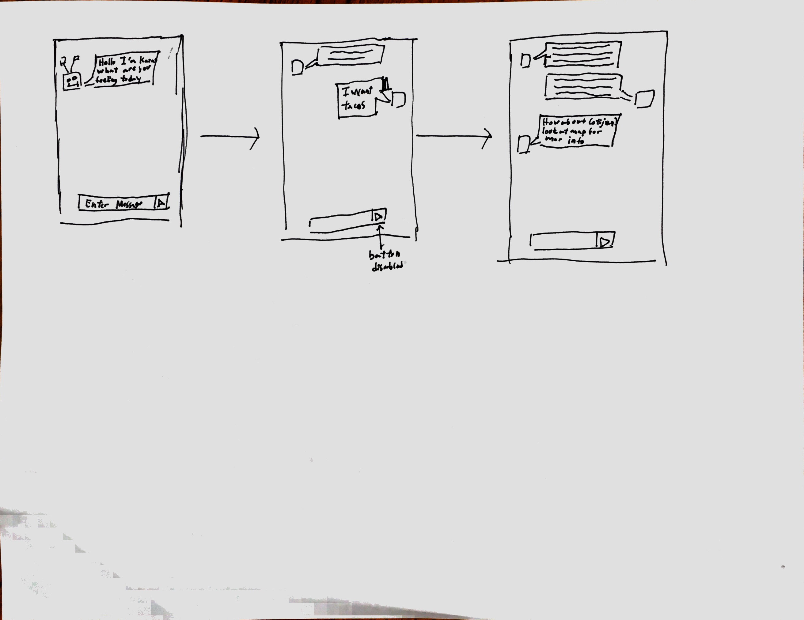

#Paper Prototypes
1. Albert: General interaction of the app. Starts from when you first open it, then branches off into different interactions.

2. Alex: General Layout of the app with the chat and map. Also shows screens that show popups that display more information about retaurant.

3. Sanjeev: This prototype shows the interactions users will make with the restaurant information windows. It demonstrates the categorization, review system, and direction finding we have planned for future implementations of MapEats.

4. Todd:  General interaction if the chat bot in the ideal case.  

