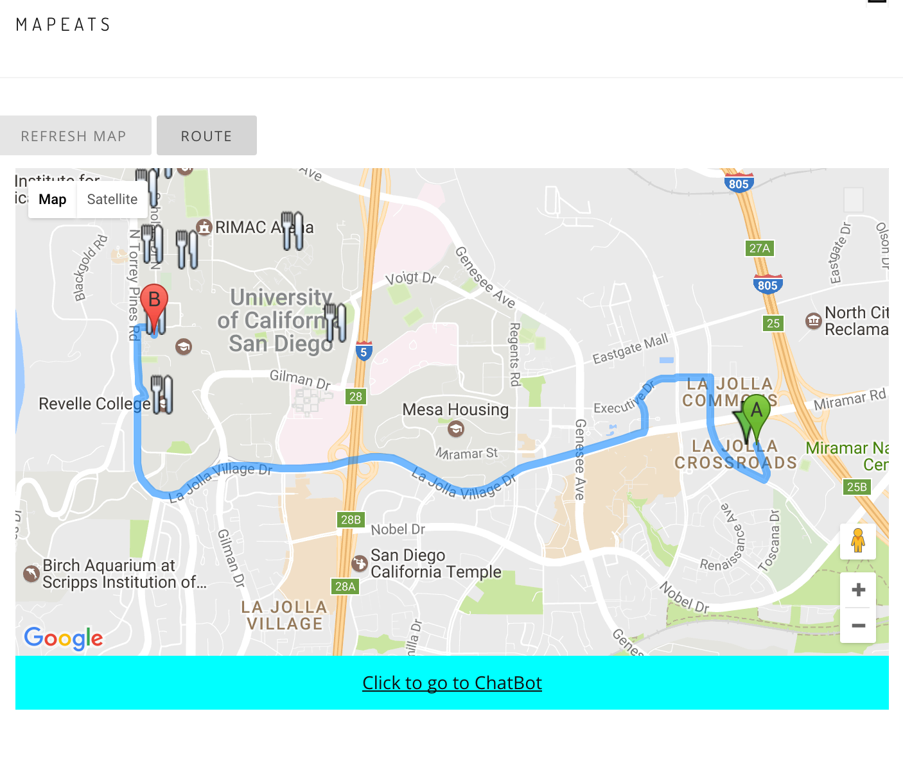
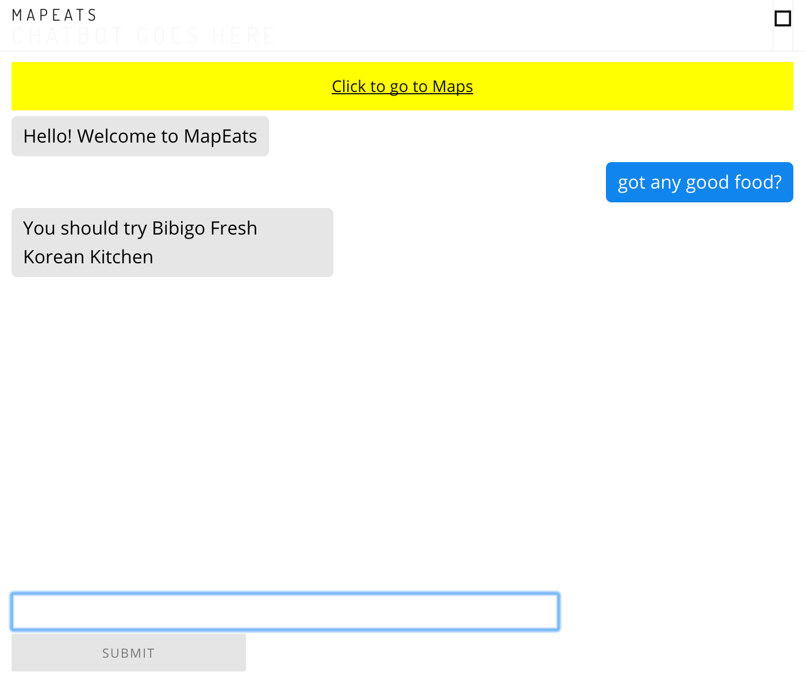

# Milestone 9

### Group Member Contributions
Alex Barcenas:
  - Semi-integrated Wit.ai and Yelp API with chatbot
  - Refined UI interactions of chatbot
 
Albert Lin:
  - Updated UI elements to handle future navigation functionality
  - Integrated Socket.io with chat functionality

Sanjeev Reddy:
  - Worked on making map InfoWindows compatible with Angular (not yet working,
    see "infowindow" branch)
  - Created markdown file

Todd Tang:
  - Fixed Socket.io integration with Angular
  - Added functions and support for map direction finding

### Screenshots
Map view: Our map now supports providing the user with driving directions to
any restaurant stored in our database. Once we fix the InfoWindow-Angular
integration, users will be able to tap on the "Go Here" button within
InfoWindows, and receive directions to the selected restaurant.

Chatbot view: This screenshot shows the current functionality of our chatbot.
The chatbot now allows users to interact with it, and recognizes basic requests
for food. It responds to these requests with restaurants from our database that
match the nature of the request

