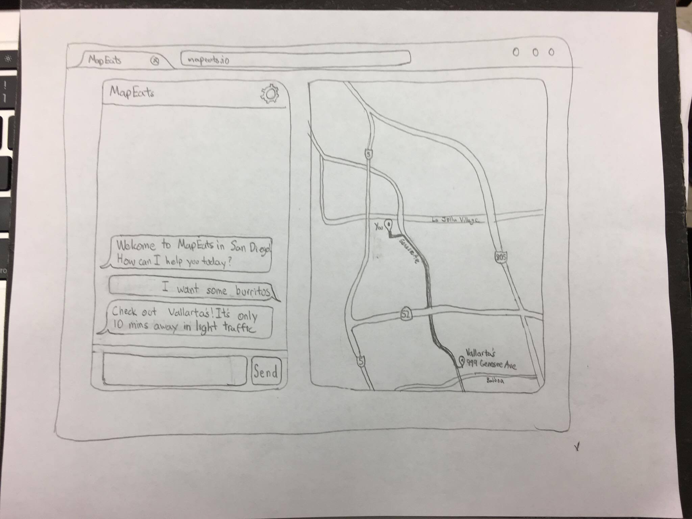
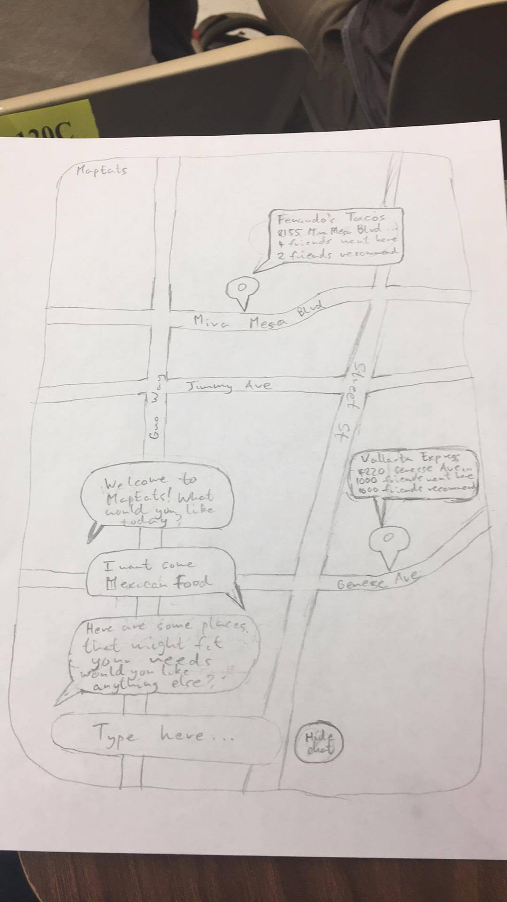
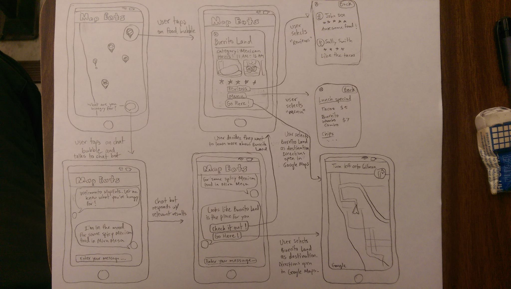
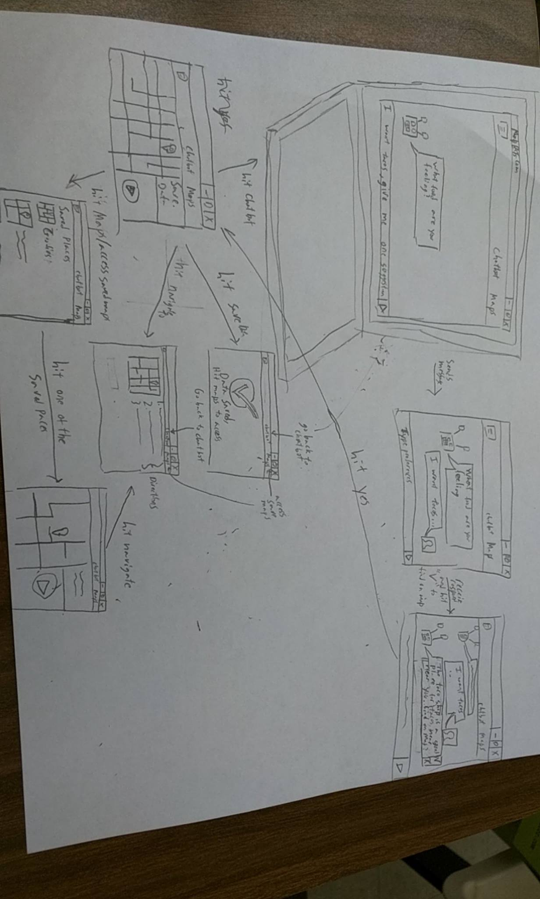

#Paper Prototypes
1. Albert: 
User is using a desktop to get suggestions from a chat. The map is automatically locating the user and giving directions to the suggested place.

2. Alex: 
The user is using a mobile version of the app where the chat is overlayed on top of the map. The user typed a food preference of Mexican food and suggestions popped up. They are able to look at sugestions and hide the chat. 

3. Sanjeev: 
This is another version of the mobile app prototype. Here, the map is the main focus of the home page. Users can tap on restaurants directly on the map in order to learn more, or they can tap on the chat bubble on the bottom right of the screen. Tapping on this bubble brings up the chat bot, which the user can interact with to receive more personalized suggestions.

4. Todd: 
Another take on the desktop version of the application. User still talks to chatbot, who responds with location of places to user. User then has options to reask, to save the location for a later date, or to get directions to the location (or any saved locations). 
