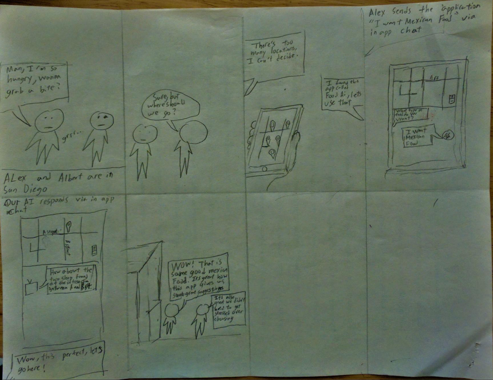

# MapEats

**What is MapEats?**
MapEats is an intelligent, cloud based bot that quickly and accurately finds
nearby restaurants tailored to the users pereferences and needs!

**Storyboard**
Getting hassle-free, tailored recommendations for the best nearby restaurants

**How did we decide on MapEats?**
We generally received positive feedback for our storyboards, but many people
felt that our other ideas had already been tried before (event finder, parking
locator), or that we did not solve problems differently from current solutions.
They noted that services such as Facebook and Google have already implemented
solutions to some of the problems that we had brought forth in our storyboards.
However, people seemed to respond with interest to the idea of food and a
chatbot. They liked the idea of having an interactive and conversational facet
to our application--a feature that they suggested we expand upon in order to
differentiate ourselves from services such as Yelp. We also received feedback
stating that a chatbot seemed like a good idea, but that we should draw more
focus to the geographic/map-based aspect of the app. Due to the positive
reactions and suggestions for improvement that we received for this idea, we
decided to pursue MapEats as our project.

**Proposed features**
The main feature that MapEats will implement is an intelligent chatbot that the
user can interact with in order to find a nearby location that fits their
current culinary desires. Our goal is for the user to be able to interact with
the bot in the same casual manner they would employ while conversing with
another person. After the user has chatted with the bot, the application will
bring up a pin on the map that specifies a restaurant meeting the user's
preferences (the user would have specified these preferences while chatting
with the bot). Here are some other features that we would like to include:
  - Get food suggestions based on places that the user's friends recommend
  - Keeping track of users' previous preferences when suggesting locations
  - The ability for users to maintain "favorites" and rate their experience
  - Find the best restaurant for multiple people based on their wants/locations
  - Randomly select a restaurant for when a user is feeling lucky!

**Splitting up the work**
We are a diverse team with a broad set of experiences! Here is how we plan
on splitting up the work:

Alex Barcenas:
  - Train the chatbot using wit.ai
  - Interface the bot with the rest of the application

Albert Lin:
  - Create a seamless and easy-to-navigate UI

Sanjeev Reddy + Todd Tang:
  - Set up a database for storing user data and locations
  - Manage front-end logic and integrate various APIs
  - General back-end work as needed
