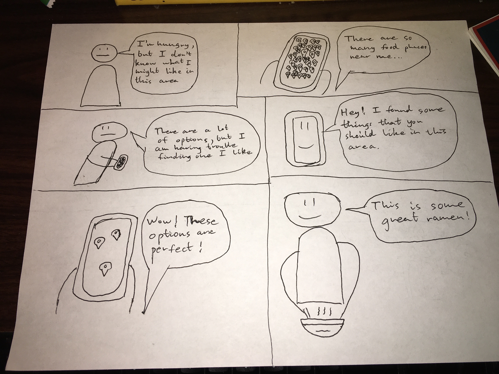
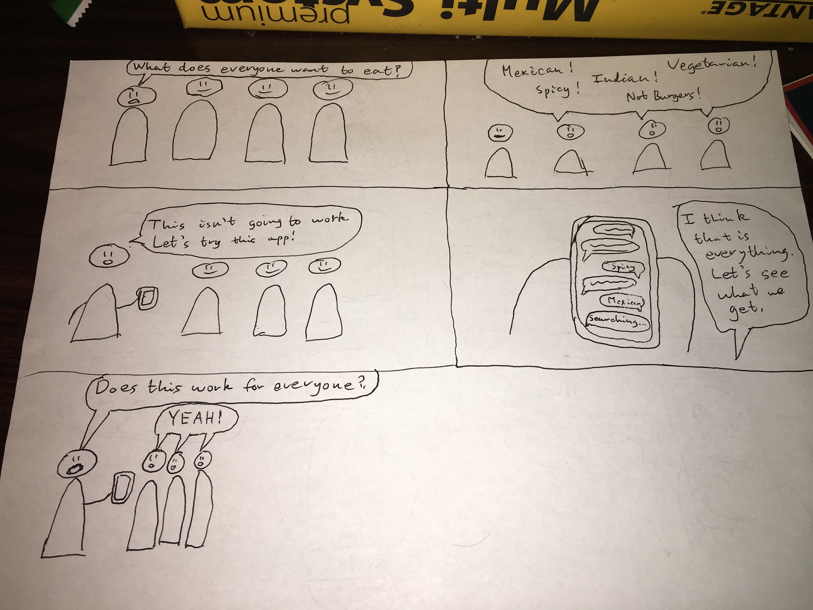

EventFinder Storyboards:
1. Finding Events of interest near me

2. Hosting Events to gather people of similar interest near me

Internet Heatmap Storyboards:
1. Finding local trending topics

2. Using Heatmap to keep informed on trending news

 
Temperature Map Storyboard:
1. Finding micro-climates/temperatures

  
TritonPark Storyboard:
1. Finding available parking on campus

Food Place Locater Chatbot Storyboards:
1. Finding new food places to visit in an unknown area

2. Finding a food place for a group that meets everyones needs

