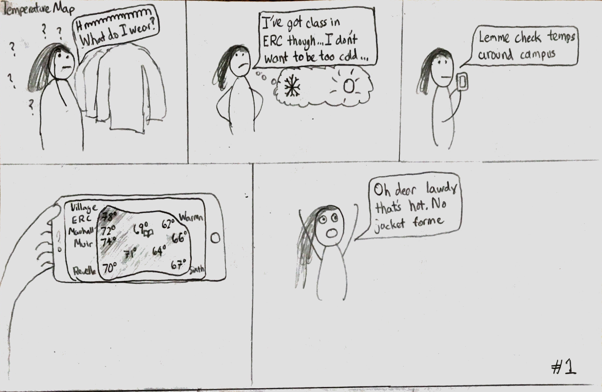
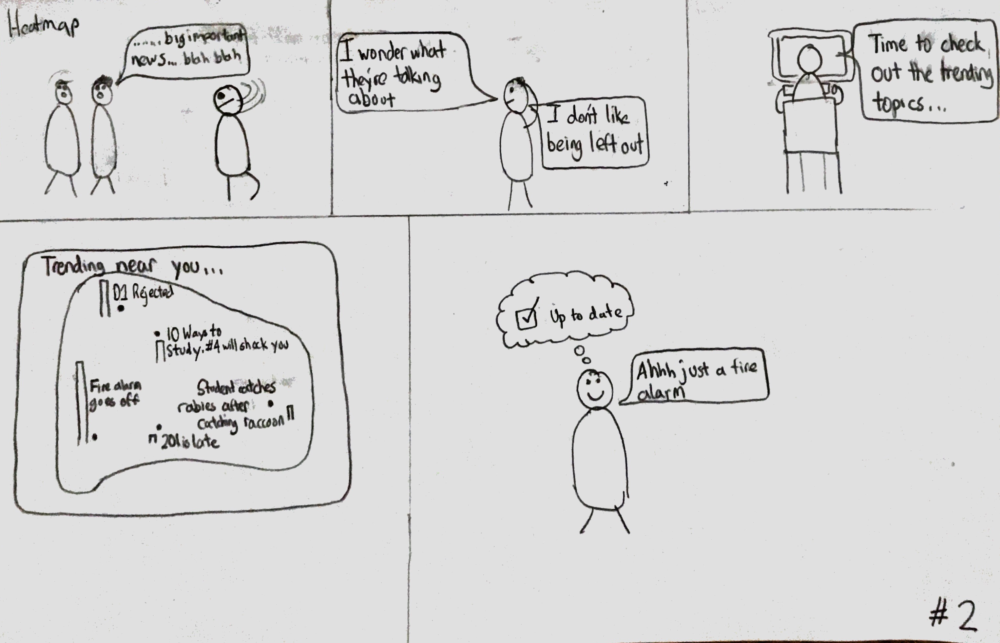
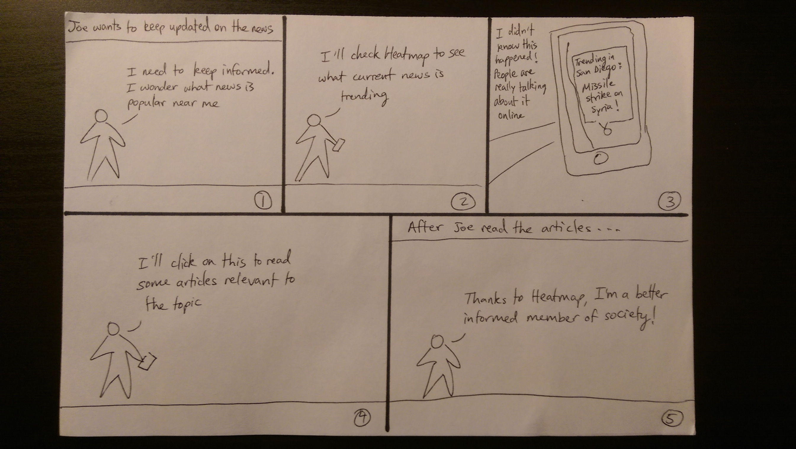
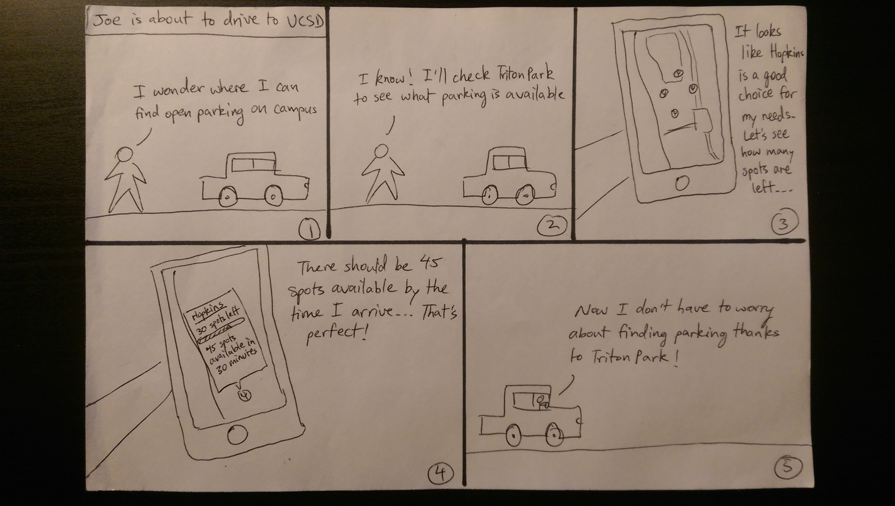

EventFinder Storyboards:
  1. Finding Events of interest near me
  
  2. Hosting Events to gather people of similar interest near me
  

Temperature Map Storyboard:
  3. Finding micro-climates/temperatures 
  
  
Internet Heatmap Storyboards:
  4. Finding local trending topics
  
  5. Using Heatmap to keep informed on trending news
  
 
TritonPark Storyboard:
  6. Finding available parking on campus
  

